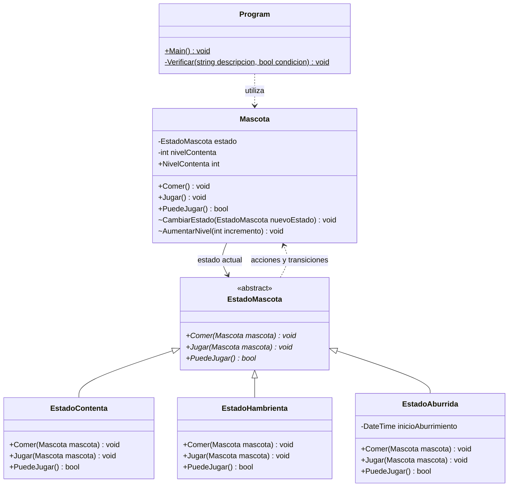

# Mascota virtual — State

```mermaid
classDiagram
    direction TB

    class Mascota {
        -EstadoMascota estado
        -int nivelContenta
        +NivelContenta int
        +Comer() void
        +Jugar() void
        +PuedeJugar() bool
        ~CambiarEstado(EstadoMascota nuevoEstado) void
        ~AumentarNivel(int incremento) void
    }

    class EstadoMascota {
        <<abstract>>
        +Comer(Mascota mascota) void*
        +Jugar(Mascota mascota) void*
        +PuedeJugar() bool*
    }

    class EstadoContenta {
        +Comer(Mascota mascota) void
        +Jugar(Mascota mascota) void
        +PuedeJugar() bool
    }

    class EstadoHambrienta {
        +Comer(Mascota mascota) void
        +Jugar(Mascota mascota) void
        +PuedeJugar() bool
    }

    class EstadoAburrida {
        -DateTime inicioAburrimiento
        +Comer(Mascota mascota) void
        +Jugar(Mascota mascota) void
        +PuedeJugar() bool
    }

    class Program {
        +Main() void$
        -Verificar(string descripcion, bool condicion) void$
    }

    EstadoMascota <|-- EstadoContenta
    EstadoMascota <|-- EstadoHambrienta
    EstadoMascota <|-- EstadoAburrida

    Mascota --> EstadoMascota : estado actual
    EstadoMascota ..> Mascota : acciones y transiciones
    Program ..> Mascota : utiliza
```

Nota: `~` identifica visibilidad interna (package) y `*` indica método abstracto; constructores omitidos.
